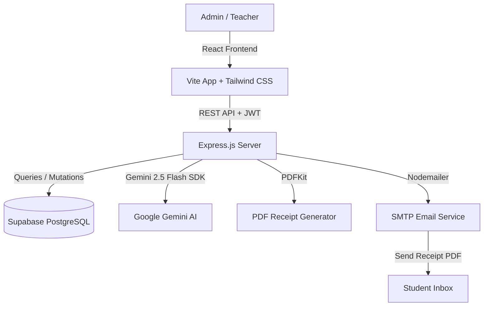
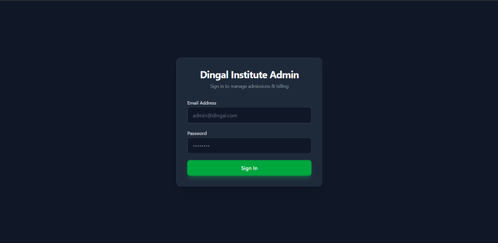
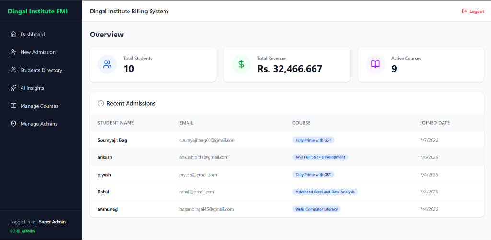
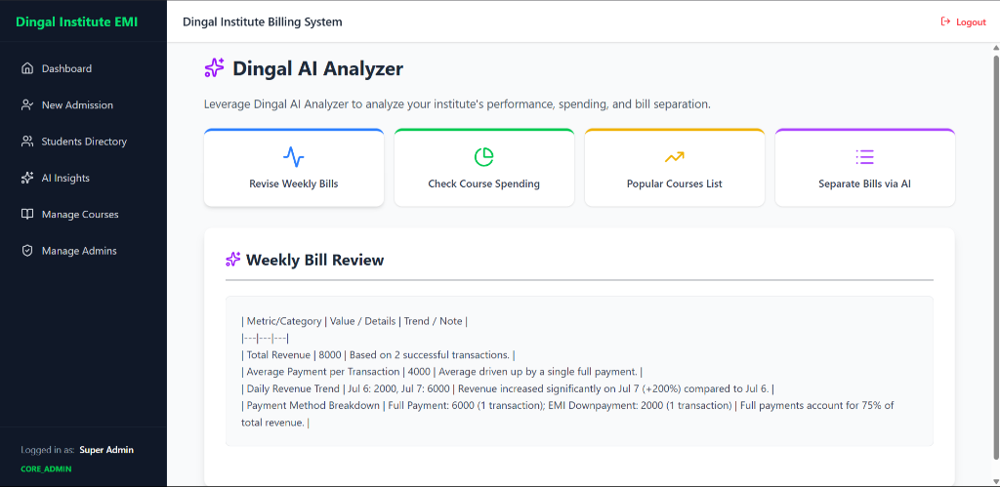

# 🎓 Dingal Institute - Billing & AI Management System

A state-of-the-art billing, student admission, and financial analysis system designed for **Dingal Institute**. This application features a robust MERN-like stack powered by **React (Vite)**, **Node.js (Express)**, **Supabase (PostgreSQL)**, and is supercharged with **Google's Gemini 2.5 Flash AI** for intelligent financial reporting and course marketing analysis.

---

## 🏗️ System Architecture & Workflow

The system is split into a decoupled client-server architecture:



---

## 📸 Features & Visual Walkthrough

### 🔒 1. Secure Role-Based Authentication
Access is restricted to authorized personnel. Users are authenticated via custom JWTs linked to their roles: `CORE_ADMIN`, `ADMIN`, or `TEACHER`.
LOGIN CREDENTIALS

Email Address:-admin@dingal.com

Password:-admin123

* **Admin Portal Login:**
  

---

### 📊 2. Operations Overview & Dashboard
The home dashboard provides an immediate, high-level overview of the institute's operations, showing key financial indicators and tracking recent actions:
* **Active Metrics:** Total enrolled students, overall revenue (in INR), and active courses count.
* **Recent Admissions:** A real-time data table listing the latest students, their registered courses, and dates of joining.

* **Dashboard Interface:**
  

---

### 🧠 3. Dingal AI Analyzer (Powered by Gemini)
The core differentiator of the application is the **AI Insights** suite. It utilizes Google's **Gemini 2.5 Flash** model to analyze structured JSON database dumps and generate clean, markdown-formatted reports on demand:

* **Weekly Bill Review:** Provides a comprehensive breakdown of weekly revenue, transaction averages, trends, and payment method details.
* **Check Course Spending:** Breaks down total revenue and enrollments by individual courses to calculate average revenue per student.
* **Popular Courses List:** Ranks courses based on registration volume and generates actionable marketing suggestions.
* **Separate Bills via AI:** Groups payment records by course and payment type, highlighting large or abnormal transactions for admin review.

* **AI Analyzer Panel:**
  

---

### 🧾 4. Automated Admissions & EMI Tracking
* **Smart Admission Flow:** Enroll students into specific courses with options for **FULL payment** or **EMI (Installments)**.
* **EMI Schedule Generator:** For EMI students, the system auto-calculates installment amounts, plans due dates, and marks them `PENDING` or `PAID`.
* **Automated Invoicing:** On successful payments, a custom PDF invoice is generated on the server using `pdfkit` and automatically emailed to the student via `nodemailer` (SMTP).

---

## 🛠️ Technology Stack

| Layer | Technology | Key Libraries |
| :--- | :--- | :--- |
| **Frontend** | React (Vite) | Tailwind CSS, Lucide React, Axios, React Router Dom |
| **Backend** | Node.js (ESM) | Express.js, JWT, Dotenv, Cors |
| **Database** | PostgreSQL | Supabase Client JS |
| **AI Integration** | Gemini API | `@google/generative-ai` (Gemini 2.5 Flash) |
| **Services** | Email & Document | PDFKit (Receipts), Nodemailer (Emails) |

---

## 🗄️ Database Schema

The PostgreSQL database (managed via Supabase) contains the following tables:
* **`users`**: Manages administrators, roles (`CORE_ADMIN`, `ADMIN`, `TEACHER`), and login credentials.
* **`courses`**: Stores available courses, their cost (fees), and duration.
* **`students`**: Contains student contact info, linked course, payment scheme (FULL/EMI), and overall balances.
* **`emi_plans`**: Logs specific installment schedules for students on EMI plans.
* **`payments`**: Details every individual financial transaction, generating receipt links and linking to specific EMIs.

> See the full SQL schema file in [supabase_schema.sql](file:///c:/Users/Bapan/Projects/dingal-billmanagement-with-ai/backend/supabase_schema.sql).

---

## 🔌 API Endpoints Summary

### Authentication (`/api/auth`)
* `POST /api/auth/register` - Create a new administrator account (Core Admin only).
* `POST /api/auth/login` - Authenticate admin and return a JWT.

### Courses (`/api/courses`)
* `GET /api/courses` - List all courses.
* `POST /api/courses` - Create a new course.

### Students & Admissions (`/api/students`)
* `GET /api/students` - Get all students.
* `GET /api/students/:id` - Fetch detailed info on a student (includes EMI plans & payment history).
* `POST /api/students` - Process a new admission (calculates fees, creates EMI list if chosen).

### Payments (`/api/payments`)
* `POST /api/payments` - Log a new payment (generates PDF, updates database balances, and emails receipt).

### AI Analyzer (`/api/ai`)
* `GET /api/ai/weekly-review` - Generate weekly bill review metrics.
* `GET /api/ai/course-spending` - Generate course enrollment and spending overview.
* `GET /api/ai/popular-courses` - Rank courses and generate marketing suggestions.
* `GET /api/ai/categorize-bills` - Generate automated smart bill separation table.

---

## 🚀 Installation & Local Development Setup

Follow these steps to run the complete stack on your local machine:

### 1. Prerequisites
Ensure you have **Node.js (v18+)** installed.

### 2. Configure Environment Variables
Create a `.env` file inside the `backend/` directory:
```env
PORT=5000
SUPABASE_URL=your_supabase_project_url
SUPABASE_KEY=your_supabase_service_role_key_or_anon_key
JWT_SECRET=your_custom_jwt_secret_key
SMTP_HOST=smtp.gmail.com
SMTP_PORT=587
SMTP_USER=your_gmail_address
SMTP_PASS=your_gmail_app_password
GEMINI_API_KEY=your_google_gemini_api_key
```

### 3. Run the Application
You can launch both the frontend and backend servers concurrently from the root directory:

```bash
# 1. Clone the repository and navigate into the folder
cd dingal-billmanagement-with-ai

# 2. Install all dependencies for root, frontend, and backend
npm run install:all

# 3. Spin up the development servers
npm run dev
```

The frontend will run on [http://localhost:5173](http://localhost:5173) and the backend will run on [http://localhost:5000](http://localhost:5000).
